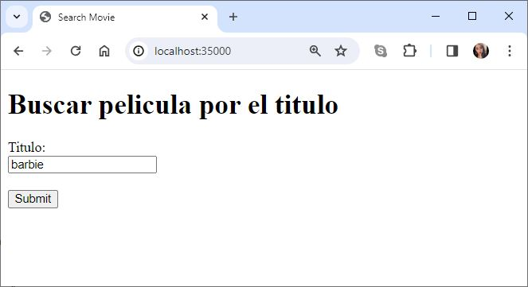

# TALLER 1: APLICACIONES DISTRIBUIDAS

Se realizo una aplicación para consultar la información de películas de cine del API https://www.omdbapi.com/.  Esta aplicación nos permite buscar por título la película deseada y conocer los datos de esta. Así mismo se implementó un Caché que evita realizar consultas repetidas al API externo.

---
### Prerrequisitos

* [Maven](https://maven.apache.org/): Es una herramienta de comprensión y gestión de proyectos de software. Basado en el concepto de modelo de objetos de proyecto (POM), Maven puede gestionar la construcción, los informes y la documentación de un proyecto desde una pieza de información central.

* [Git](https://learn.microsoft.com/es-es/devops/develop/git/what-is-git): Es un sistema de control de versiones distribuido, lo que significa que un clon local del proyecto es un repositorio de control de versiones completo. Estos repositorios locales plenamente funcionales permiten trabajar sin conexión o de forma remota con facilidad.

---

### Instalación

1.Clonamos el repositorio

```
https://github.com/AREP2024-1/AREP_Taller01.git
```

2.Ingresamos a la carpeta del repositorio que clonamos anteriormente

```
cd AREP_Taller01
```

3.Contruimos el proyecto

```
mvn package
```

---

### Ejecución

1.Ejecutamos los siguientes comandos

```
 mvn clean package install
 mvn clean install
```

2.Levantamos el servidor

***Windows:***

```
mvn exec:java -"Dexec.mainClass"="edu.eci.arep.ASE.app.HTTPServer" 
```

***MacOs y Linux:***

```
mvn exec:java -Dexec.mainClass="edu.eci.arep.ASE.app.HTTPServer" 
```

3.Probamos nuestra aplicación accediendo a la siguiente URL en el navegador
```
http://localhost:35000/" 
```


---
### Ejecución de Test

Ejecutamos el siguiente comando

```
mvn test 
```

---

### Construido con

* [Maven](https://maven.apache.org/): Es una herramienta de comprensión y gestión de proyectos de software. Basado en el concepto de modelo de objetos de proyecto (POM), Maven puede gestionar la construcción, los informes y la documentación de un proyecto desde una pieza de información central.

* [Git](https://learn.microsoft.com/es-es/devops/develop/git/what-is-git): Es un sistema de control de versiones distribuido, lo que significa que un clon local del proyecto es un repositorio de control de versiones completo. Estos repositorios locales plenamente funcionales permiten trabajar sin conexión o de forma remota con facilidad.

* [GitHub](https://platzi.com/blog/que-es-github-como-funciona/): Es una plataforma de alojamiento, propiedad de Microsoft, que ofrece a los desarrolladores la posibilidad de crear repositorios de código y guardarlos en la nube de forma segura, usando un sistema de control de versiones llamado Git.

* [Java -17](https://www.cursosaula21.com/que-es-java/): Es un lenguaje de programación y una plataforma informática que nos permite desarrollar aplicaciones de escritorio, servidores, sistemas operativos y aplicaciones para dispositivos móviles, plataformas IoT basadas en la nube, televisores inteligentes, sistemas empresariales, software industrial, etc.

* [JavaScript](https://universidadeuropea.com/blog/que-es-javascript/): Es un lenguaje de programación de scripts que se utiliza fundamentalmente para añadir funcionalidades interactivas y otros contenidos dinámicos a las páginas web.

* [HTML](https://aulacm.com/que-es/html-significado-definicion/): Es un lenguaje de marcado de etiquetas que se utiliza para crear y estructurar contenido en la web. Este lenguaje permite definir la estructura y el contenido de una página web mediante etiquetas y atributos que indican al navegador cómo mostrar la información.

* [Visual Studio Code](https://openwebinars.net/blog/que-es-visual-studio-code-y-que-ventajas-ofrece/): Es un editor de código fuente desarrollado por Microsoft. Es software libre y multiplataforma, está disponible para Windows, GNU/Linux y macOS.


## Autor

* **[Karol Daniela Ladino Ladino](https://www.linkedin.com/in/karol-daniela-ladino-ladino-55164b272/)** - [20042000](https://github.com/20042000)


## Licencia
**©** Karol Daniela Ladino Ladino. Estudiante de Ingeniería de Sistemas de la Escuela Colombiana de Ingeniería Julio Garavito

